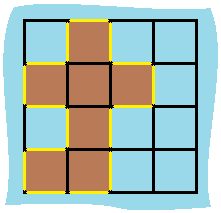

## Problem Definition
You are given a map in form of a two-dimensional integer grid where 1 represents land and 0 represents water. Grid cells are connected horizontally/vertically (not diagonally). The grid is completely surrounded by water, and there is exactly one island (i.e., one or more connected land cells). The island doesn't have "lakes" (water inside that isn't connected to the water around the island). One cell is a square with side length 1. The grid is rectangular, width and height don't exceed 100. Determine the perimeter of the island.

### Example:
```bash
[[0,1,0,0],
 [1,1,1,0],
 [0,1,0,0],
 [1,1,0,0]]

Answer: 16
Explanation: The perimeter is the 16 yellow stripes in the image below:
```


### Solution analysis
First of all, you need to identify the island's land points. Land (the element in the two dimentional array that has element of 1) are connected to form the island. Each land should have four edges, but since two lands (or more) are interconnected, the double counted edge should be substracted from the perimeter.

For exmaple, land (0,1) and land (1,1) are interconnected, so the edge between them should be substracted. When we count a land, we ignore the adjacent edges first then do the substract. So in my example, the total edges between (0,1) and (1,1) is `4 + 4 - 2 = 6`. So here comes our pseudo code:

### Pseudo code:
```bash
# traverse the two-d array and identify land points.
row = len(grid)
col = len(grid[0])
perimeter = 0

for r in range(row):
    for c in range(col):
        # If this is a land
        if grid[x][y] == 1:
            perimeter += 4
            if grid[x-1][y] == 1:
                perimeter -=2
            if grid[x][y-1] == 1:
                perimeter -=2
return perimeter
```